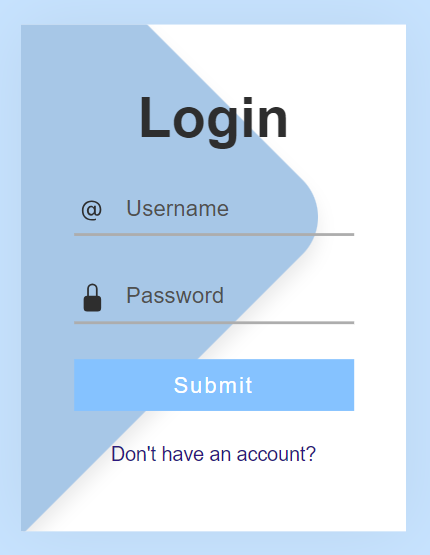
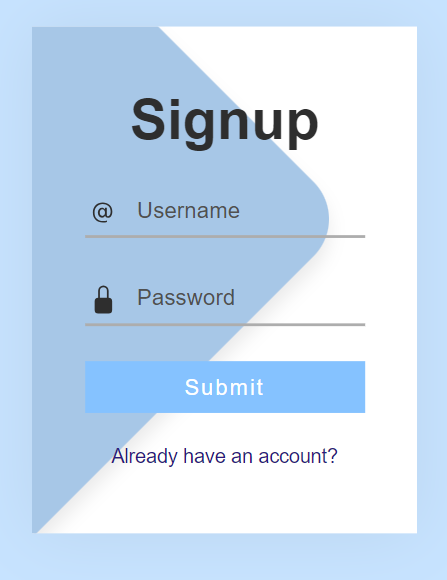

# Simple Login and Signup Site
This is a simple login and signup site created using Flask. It allows users to create an account, log in, and view a success page if the login is successful. The site uses a database to store user information.

## Images
<div align="center">
  <p>Login Page (login.html)</p>

    <p>Signup Page (Signup.html)</p>


</div>

## Prerequisites
- Python 3.x
- Flask

## Installation
1. Clone the repository or download the source code files.
2. Install Flask by running the following command:
```
pip install flask
```
3. Run the Flask application by executing the following command:
```
python app.py
```
## Usage
1. Access the application by opening your web browser and navigating to http://localhost:5000.
2. The home page displays a signup form where users can create an account. Clicking the "Signup" button will validate the form and create an account if the provided information is valid. If the username already exists or the password is less than 8 characters, appropriate error messages will be displayed.
3. After successfully creating an account, users can click the "Login" button to access the login page. On the login page, users need to enter their username and password.
4. Upon clicking the "Login" button, the entered credentials will be validated against the stored user information in the database. If the credentials are correct, users will be redirected to a success page. Otherwise, an error message will be displayed, indicating incorrect username or password.
Success Page

## Project Structure
- `app.py`: The main Flask application file containing the route handlers and logic for signup, login, and success pages.
- `templates/`: This directory contains the HTML templates for signup, login, and success pages.
- `static/database/databases.py`: The module responsible for database operations, including inserting and fetching user information.
## Configuration
- `app.secret_key`: The secret key used by Flask to encrypt session data. Modify this key to improve security.
### Disclaimer
This is a basic implementation meant for learning and demonstration purposes. It is not intended for production use. Additional security measures, such as secure session management, should be implemented for a real-world application.